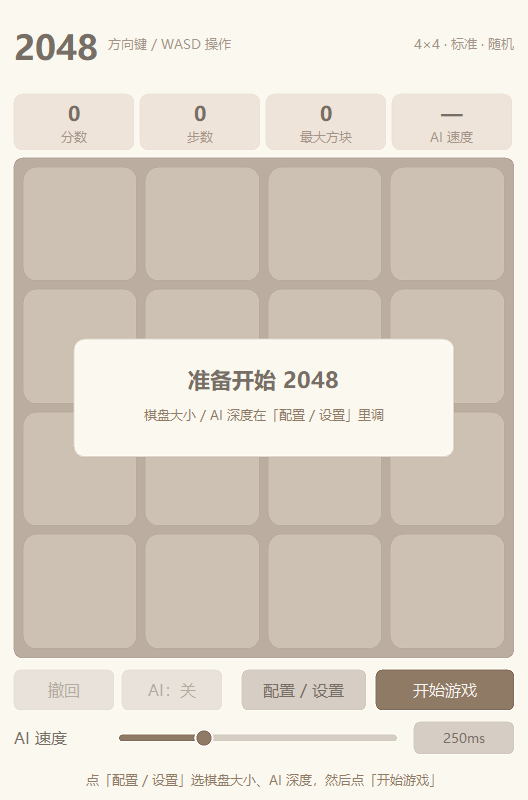
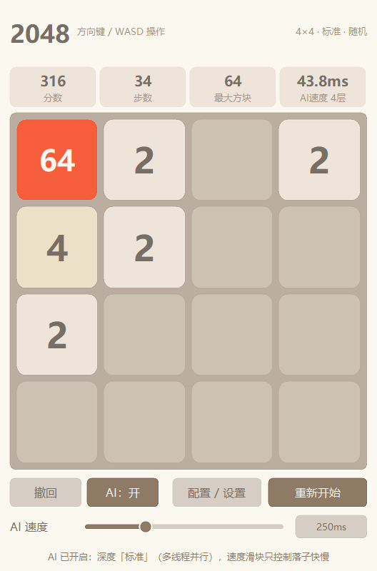
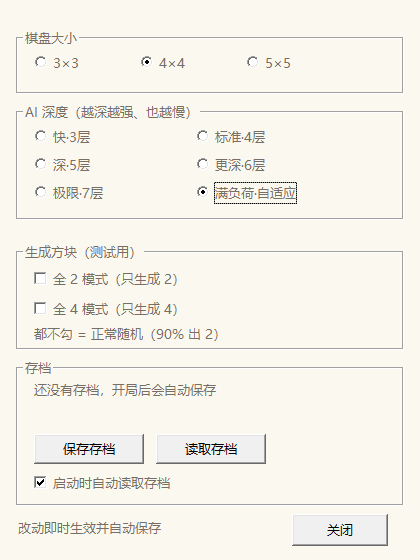
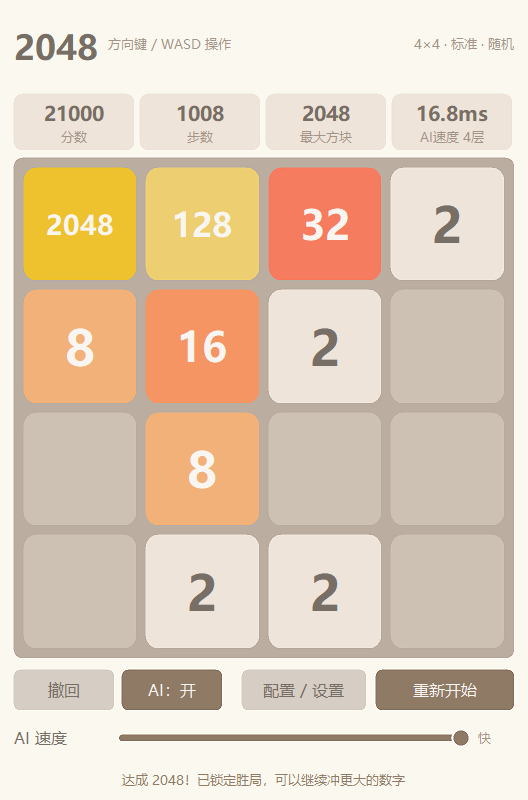
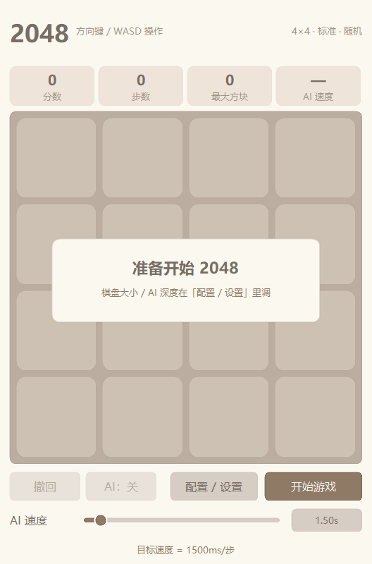
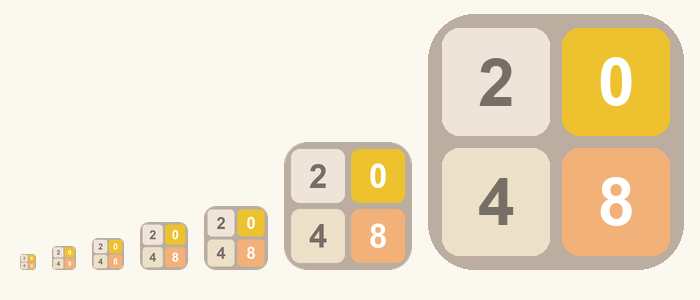

# 2048（C++ / Win32 原生窗口）+ 蛇形算法 AI

一个零依赖的 Windows 原生 2048：单文件 C++ 源码 + 自绘界面 + 内置蛇形算法 AI + 多线程深搜。
不依赖 Qt / SDL / .NET，编译出来就是一个带图标、带版本信息的独立 exe。

| 开局界面 | 主界面（单行按钮区 + 拉长的速度滑块） | 配置 / 设置窗口 |
| --- | --- | --- |
|  |  |  |

| 4×4 · AI 合出 2048 | 速度滑块：点右侧可直接输入毫秒 | 应用图标（2×2 方块） |
| --- | --- | --- |
|  |  |  |

---

## 1. 快速开始

**直接玩**：双击 `game2048.exe`（仓库里已编译好，静态链接，无需任何运行库）。

**重新编译**：双击 `build.bat`。脚本会先编译 `app.rc`（图标 + 版本信息），
再自动在 `g++` / `zig` / MSVC `cl` 里挑一个可用的编译器。

```bash
# 1) 编译资源（图标 + 版本信息）—— zig 或 windres 二选一
zig rc app.rc app.res
# 2) 编译程序（MinGW-w64 / MSYS2 / zig 自带的 clang）
g++ -O2 -std=c++17 -o game2048.exe game2048.cpp app.res -mwindows -lgdi32 -luser32 -static
# MSVC
cl /nologo /O2 /EHsc /std:c++17 /utf-8 /DUNICODE /D_UNICODE game2048.cpp app.res ^
   /Fe:game2048.exe /link /SUBSYSTEM:WINDOWS user32.lib gdi32.lib
```

> 用 zig：链接参数写 `-Wl,--subsystem,windows`（`-mwindows` 在 zig/lld 下会被忽略）。
> 本机没装编译器时，用清华 PyPI 镜像下 `ziglang` 的 wheel 解压即可得到完整 clang 工具链。

---

## 2. 功能一览

| 功能 | 说明 |
| --- | --- |
| 开局流程 | 启动显示「开始游戏」；棋盘上盖一张「准备开始 2048」卡片 |
| 棋盘大小 | 3×3 / 4×4 / 5×5，**只在配置窗口里选**（主界面不再出现大小选项） |
| 操作 | ↑↓←→、WASD、小键盘 8/2/4/6；回车 = 开始 / 重新开始 |
| 分数与步数 | 顶部数据框：**分数 / 步数 / 最大方块 / 实时 AI 速度**（目标值不再占位显示） |
| 实时 AI 速度 | 第 4 格实时显示「每步耗时 + 实际搜索层数」（如 `2.70s / 6层`），指数平滑不跳数 |
| 大字号 | 主界面按钮/说明 13~16pt、数据框数值 20pt，低分辨率也看得清 |
| 单行按钮区 | `撤回` / `AI：开` / `配置设置` / `开始重新开始` 排成一行；下一行是「AI 速度」标签 + 拉长铺满的滑块 |
| 撤回 | 每步入栈（含 AI 的步），可连续回退，棋盘/分数/步数一起还原 |
| AI 开关 | `AI：开 / AI：关`，随时接管或收回；AI 托管时按键盘会提示先关掉 |
| **AI 速度滑块** | 60 挡对数刻度，**最慢 3000ms/步 ~ 最快 1ms/步**；右侧实时显示**目标速度**（`1.50s` / `250ms`），点它可直接输入毫秒 |
| AI 深度 | 配置里的「AI 深度」决定搜索层数（6 档，3~7 层 + 自适应），与速度滑块互不影响 |
| **配置 / 设置窗口** | 独立子窗口：棋盘大小、AI 深度、生成方块模式、存档；改动即时生效并落盘 |
| **全 2 / 全 4 测试模式** | 只生成 2 或只生成 4（两个互斥勾选框），**AI 也会按该规则思考**，用于测试 |
| **完整方块配色** | 2 一直到 4194304 每个数值都有独立配色（暖金→紫→蓝→青→绿→棕→石墨） |
| **存档 / 续玩** | 自动存档（每 1.5 秒最多一次 + 退出时）+ 手动保存/读取 + 启动自动读取 |
| **应用图标** | 2×2 方块拼成的 `{2,0 / 4,8}`，内嵌 16~256 七个尺寸 + 版本信息（资源管理器可直接看到） |
| **抗锯齿** | 图形按 2× 超采样渲染后缩小；**文字不参与缩放**，单独用 1× ClearType 画在最上层，小字也清晰 |
| AI 每次都要合出 2048 | 见第 5 节实测数据 |

---

## 3. AI 是怎么下棋的

### 3.1 蛇形（Snake）评估

把棋盘格子按**蛇形路径**排成一维序列，路径越靠前的格子权重越大，权重按底数 `b` 指数衰减
（`b^24 … b^0`，实测 `b=2` 最好）。评估值 = `Σ(格子数值 × 该格权重) + 空格数 × w0 × 8`。

```
4×4 蛇形权重（数字越大越重要，路径 15 → 0）
   15 14 13 12
    8  9 10 11
    7  6  5  4
    0  1  2  3
```

于是 AI 会自发形成「最大方块压在角落 + 数值沿蛇形路径单调递减」的阵型——这正是 2048
能长期存活、稳定合出 2048/4096 的经典形态。

### 3.2 期望极大极小 + 迭代加深 + 时间预算

- **MAX 节点**：我方在 4 个方向里选评估最高的一步；
- **CHANCE 节点**：新方块的位置与数值取数学期望（每个空格 `1/空格数` 概率被选中，90% 出 2、10% 出 4）；
  在全 2 / 全 4 测试模式下，期望模型会同步变成「必出 2」/「必出 4」，所以 AI 不是算错模型在瞎下。
- 每步从 2 层起逐层加深，用「上一层耗时 × 2×空格数」预估下一层开销，**预估会超预算就提前收工**；
  另有 1 步贪心兜底，保证任何预算下都不会退化成乱走。

### 3.3 多线程并行（所有档位都用满 CPU）

4×4 的搜索代价每层涨约 20 倍，所以 4 层以上走并行：把「方向 × 每个空格」拆成几十个规模相近的
子任务，用原子计数器分发给工作线程，最后按方向汇总。

关键在于**线程池**：早期版本每层都新建线程，12 线程光创建就要 ~1ms，浅层搜索反而更慢；
改成常驻线程池（条件变量 + 任务代数唤醒）后，标准档单步从 **74ms → 21.6ms（3.4× 加速）**，
所以现在各档都默认用满所有核心：

| 档位 | 搜索深度 | 概率剪枝 | 单步耗时（4×4 实测） | 说明 |
| --- | --- | --- | --- | --- |
| 快·3层 | 固定 3 层 | 1e-4 | 约 1ms | 层数太浅，走单线程更快 |
| 标准·4层（默认） | 固定 4 层 | 1e-4 | 约 21ms | 日常推荐 |
| 深·5层 | 固定 5 层 | 1e-5 | 约 1.3s | 10.2 核（85%） |
| 更深·6层 | 固定 6 层 | 1e-7 | 开局约 20s、中后盘约 3s | 残局才跑得满 6 层 |
| 极限·7层 | 固定 7 层 | 1e-7 | 开局 20s 起 | 中后盘 6~7 层 |
| 满负荷·自适应 | 自适应加深（实测 6 层） | 1e-5 | 约 2.7s | 9.7 核（80%） |

**为什么深档在开局那么慢？** 4×4 每个 chance 层要展开「方向 × 每个空格 × 2 种新方块」，
分支因子约 24；再深一层就是 24 倍工作量。开局空格最多（12~14 个），所以 6 层要几十秒；
等棋盘填到只剩 4~6 个空格时，同样 6 层只要几秒 —— 而残局正是最需要深算的时候。

**概率剪枝必须跟着深度一起放宽**（3~4 层用 1e-4、5 层用 1e-5、6/7 层用 1e-7）：
固定 1e-5 时，累计概率到第 4 层就低于阈值被剪掉，标称的「6 层」其实跑不到 6 层。

所有档位都带**成本预估**：下一层预估跑不完就提前收工，所以深档会自动停在「算得完」的那一层，
**界面第 4 格显示的永远是真的搜到了几层**（如 `19.7s / 5层`），不会拿标称值糊弄你。

### 3.4 AI 速度滑块（60 挡 · 3000ms ~ 1ms · 可输入毫秒）

滑块是**对数刻度 60 挡**，覆盖 3000ms/步（最慢）到 1ms/步（最快）——线性刻度会让 1ms 那端挤成一堆，
对数刻度每挡大约变化 13%，拖起来手感均匀。

右侧的圆角小框实时显示**目标速度**（`1.50s` / `250ms`），**点它可以直接输入精确毫秒**：
填 1~3000 的数字，回车确认（Esc 取消；点到别处也算确认），超范围自动夹到 1 / 3000。
这个值就是 AI 每步之间的等待时间，和存档一起保存。

```
滑块：  1ms ←———●———————————————→ 3000ms       [1.50s]  ← 点这里输入
```

> 速度滑块只管「落子间隔」，搜索层数由 AI 深度档决定，两者互不影响。

### 3.5 参数（命令行可覆盖）

```bash
game2048_bench.exe --bench 4 30            # 4×4 打 30 局，结果写入 bench_result.txt
game2048_bench.exe --sweep 4 10            # 参数扫描：一次跑多组参数并打印对比表
# 单参数：--think 毫秒  --depth 层数(0=自适应)  --threads 线程数(0=全部核心)
#         --cutoff 概率  --base 底数  --empty 空格系数  --merge 合并系数  --spawn4 0/1
# 复现「满负荷」档：
game2048_bench.exe --bench 4 10 --depth 0 --cutoff 1e-5 --think 5000 --threads 0
```

扫描实测（4×4、每组 10 局、固定 4 层）——**「更陡的蛇形」和「过大的空格奖励」都会明显变差**：

| 配置 | 达标率 | 最大方块 |
| --- | --- | --- |
| 底数2 空格5 / 空格12 | **100%** | 4096 |
| 底数2 空格3 / 底数1.6 空格8 / 底数2.5 空格8 | 90% | 4096 |
| 底数2 空格8（默认） / 空格16 | 80% | 4096 |
| 底数4 空格1.5（最初拍脑袋的配置） | 83% | 4096 |
| 底数4 空格25 / 空格80 | 50% / 17% | 4096 / 2048 |
| 加「合并相邻对」奖励 20 / 200 | 17% / 0% | 2048 / 1024 |

---

## 4. 配置 / 设置窗口

主界面右下角「配置 / 设置」按钮打开，独立子窗口（原生控件，13pt 字号与主界面说明文字一致，
改动即时生效并自动写入存档文件）。**棋盘大小只在这里设置**，主界面不再重复放选项。

| 分组 | 内容 |
| --- | --- |
| 棋盘大小 | 3×3 / 4×4 / 5×5（游戏中改会在下次「重新开始」生效，状态栏会提示） |
| AI 深度 | 共 **6 档**：快·3层 / 标准·4层 / 深·5层 / 更深·6层 / 极限·7层 / 满负荷·自适应（游戏中可随时换，会立刻中止当前搜索） |
| 生成方块（测试用） | 全 2 模式 / 全 4 模式（互斥勾选；都不勾 = 正常随机 90% 出 2） |
| 存档 | 保存存档 / 读取存档 / 启动时自动读取存档 |

## 5. 存档

- 位置：`%APPDATA%\Game2048\save.dat`（纯文本格式，可以直接打开看/改）
- 内容：棋盘大小、目标、当前棋盘、分数、步数、AI 深度档、生成模式、**AI 速度（毫秒）**、自动读取开关 + 最近 200 步历史
- 时机：每 1.5 秒最多自动存一次 + 关闭窗口时一定存；配置一改也会立刻存
- 启动时若开着「自动读取存档」，会直接恢复上次的局（含全部撤回记录），状态栏会提示
- 「读取存档」按钮可随时手动读取；「保存存档」手动落盘

---

## 6. 压测与实测数据

| 棋盘 | 档位 | 局数 | 目标 | 达标率 | 最大方块 | 平均分数 | 平均步数 | 平均每步 |
| --- | --- | --- | --- | --- | --- | --- | --- | --- |
| 4×4 | 标准 | 4 | 2048 | **4/4 = 100%** | 4096 | 41,103 | 2,044 | 74ms（旧·单线程） |
| 4×4 | 标准 | 1 | 2048 | 1/1 | 4096 | 37,040 | 1,946 | **21.6ms（新·线程池）** |
| 4×4 | 标准（更早的配置） | 40 | 2048 | **36/40 = 90%** | 4096 | 46,640 | 2,262 | 14.6ms |
| 3×3 | 标准 | 6 | 256 | 5/6 = 83.3% | 256（理论极限 1024） | 2,524 | 198 | 15ms |
| 5×5 | 标准 | GUI 实测 | 2048 | **70 秒内到达，并继续冲到 32768** | 32768 | 503,580 | 17,492 | ~4ms |

GUI 端到端验证：真实窗口里开 AI（标准档、滑块 9 档 ≈ 每步 76ms 含渲染），
约 **78 秒**合出 2048（21,048 分 / 1,020 步），状态栏弹出「达成 2048！已锁定胜局」；
5×5 全 4 测试模式下 40 步就能合到 128。

---

## 7. 文件说明

| 文件 | 说明 |
| --- | --- |
| `game2048.cpp` | 全部源码（核心规则 + AI + 多线程 + 存档 + Win32 界面 + 配置窗口 + 命令行压测），单文件 |
| `game2048.exe` | 图形版（已编译，带图标和版本信息，双击即玩） |
| `game2048_bench.exe` | 控制台压测版（`--bench` / `--sweep`） |
| `app.rc` / `app.res` | 图标 + 版本信息 资源脚本与编译产物 |
| `assets/game2048.ico` | 应用图标（2×2 的 {2,0/4,8} 方块，16/24/32/48/64/128/256 七个尺寸） |
| `assets/make_icon.py` | 图标生成脚本（Pillow 重画各尺寸 + 预览图，改图标就改它） |
| `assets/icon-*.png` | 图标各尺寸 PNG 与预览图 |
| `build.bat` | 一键编译（先编资源，再挑编译器） |
| `README.md` | 本说明 |
| `game2048.py` | Python + Tkinter 的**旧版参考实现**（无深度档/多线程/设置窗口，仅作对照） |
| `bench_result.txt` | 压测逐局明细 |
| `screenshots/` | 界面截图 |

---

## 8. 注意事项

- **3×3 合不出 2048**：9 格理论极限只有 1024（还需近乎完美的操作），实测平均到 235、偶尔 512，
  所以 3×3 目标自动下调为 **256**；4×4、5×5 目标都是 2048。
- **深 / 满负荷档很吃机器**：每步 1~3 秒、整机 80%~85% CPU，笔记本建议插电；
  「标准」档现在也是多核并行（约 21ms/步），比单线程快 3 倍多。
- 界面尺寸固定（主窗口客户区 528×800，配置窗口 420×528），不支持拉伸；
  图形按 2× 超采样渲染再缩小获得抗锯齿，**文字则不参与缩放**（单独 1× 画在最上层），
  所以小字号也是 ClearType 清晰的，不会被缩糊。
- 窗口支持 `WM_PRINTCLIENT`，截图/录屏/远程查看都能拿到完整画面（被别的窗口遮住也能截到）。
